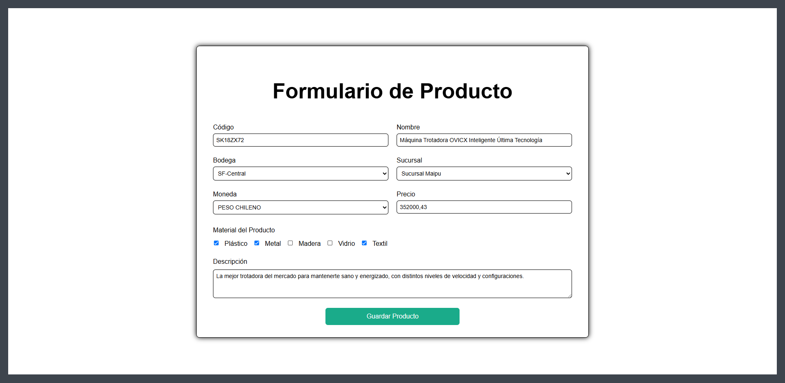
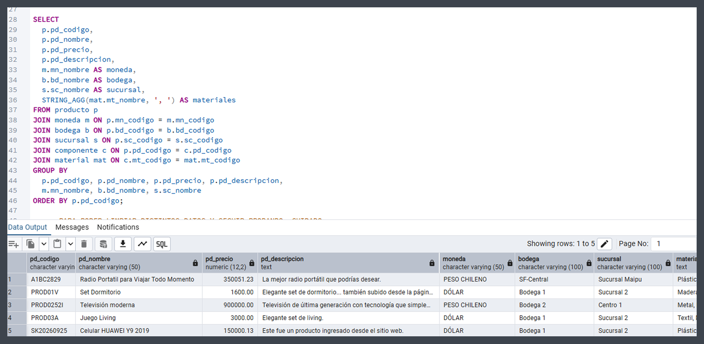
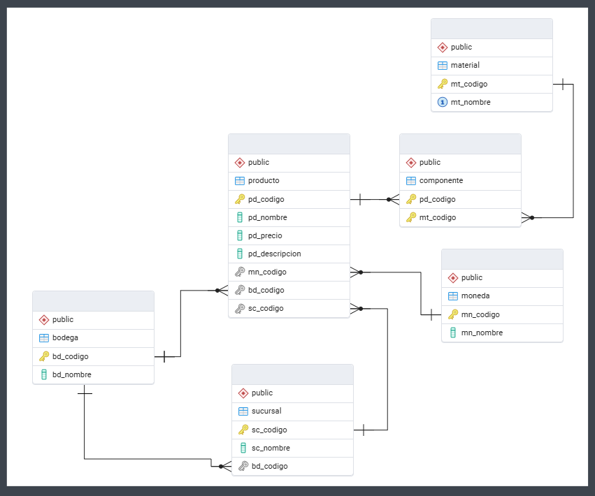

# Sistema de Registro de Productos
Prueba de diagnóstico que incluye un sistema de registro de productos. 
<br> HTML, CSS, PHP, JS, Ajax, PostgreSQL. 
<br> La interfaz valida y guarda los datos en una base de datos.

<hr>



<hr>

# Requerimientos
- PostgreSQL (Utilizado: 18.0-1)
- PHP (Utilizado: 8.2.12)

<hr>

# Recomendado
- pgAdmin4 (Utilizado: 9.8) u otro gestor de bases para verificar inserciones y relaciones.
- XAMPP (Utilizado: 8.2.12-0) o alternativas que permitan la conexión entre PHP y PostgreSQL.

<hr>

# Dependencias
- Este proyecto no cuenta con dependencias o librerías a instalar.
- No se han utilizado frameworks externos, se usaron estructuras estándar y funciones nativas.

<hr>

# Instalación
### 1. Clona el repositorio
Utiliza tu gestor git de preferencia (ej: GitHub Desktop) o clona desde la terminal.
```bash
git clone https://github.com/tu-usuario/pruebas-registro-productos.git
cd pruebas-registro-productos
```

### 2. Recrear la base de datos

En PostgreSQL, crea la base de datos y sus tablas utilizando uno de los siguientes archivos:

- `01-schema-bd-productos.sql` - incluye tablas, relaciones y ejemplos básicos.
- `03-backup-bd-basica.sql` - incluye lo anterior y puede cargarse rápidamente en pgAdmin 4.

Si buscas comprobar el funcionamiento de esta base de datos,<br>
adjunto el siguiente archivo con consultas de utilidad.

- `02-consultas-utiles.sql` 

### 3. Configura las variables de entorno
Crea un archivo `.env` en la raíz del repositorio (`pruebas-registro-productos/`) y define los parámetros de conexión a tu base de datos de PostgreSQL.
```bash
PG_HOST=localhost
PG_PORT=5432
PG_DBNAME=tu_bd
PG_USER=tu_usuario_postgresql
PG_PASSWORD=tu_contraseña
```

### 4. Si utilizas XAMPP, verifica tu entorno
Debes verificar que PHP tenga la extensión `pgsql` habilitada para que tu archivo `.env` esté siendo leído correctamente. Verifica que las siguientes extensiones estén habilitadas en `php.ini` (sin ; al inicio):
```ini
extension=pgsql
extension=pdo_pgsql
```
Si deseas trabajar en una ruta distinta a htdocs, puedes configurar un Alias en `httpd-vhosts.conf`.<br>
Esto te permitirá acceder al proyecto desde `http://localhost/pruebas-registro-productos`
```bash
Alias /pruebas-registro-productos "C:/Ruta/Al/Repositorio"

<Directory "C:/Ruta/Al/Repositorio">
    Options Indexes FollowSymLinks
    AllowOverride All
    Require all granted
</Directory>
```
Recuerda reiniciar Apache en XAMPP después de modificar httpd-vhosts.conf o php.ini.

<hr>

# Observaciones y comentarios
### 1. Front End
- Se ha recreado el estilo pedido por el diagnóstico con la mayor exactitud posible.
- Se han aplicado estilos para asegurar consistencia entre distintos navegadores.

### 2. Back End
- Las validaciones y alertas se gestionan principalmente desde los archivos JavaScript, siguiendo el orden descrito en la prueba de diagnóstico.
- Además, se ha incluido manejo de errores en los archivos PHP y en la BD SQL.

### 3. Base de Datos
- Los tres elementos cargados de manera dinámica (`moneda`, `bodega` y `sucursal`) han recibido sus propias tablas para ser extraídos directamente desde la base de datos.
- Los materiales presentes en un producto han recibido su propia tabla para asegurar escalabilidad, conectándose a través de una tabla intermedia llamada `componente`.